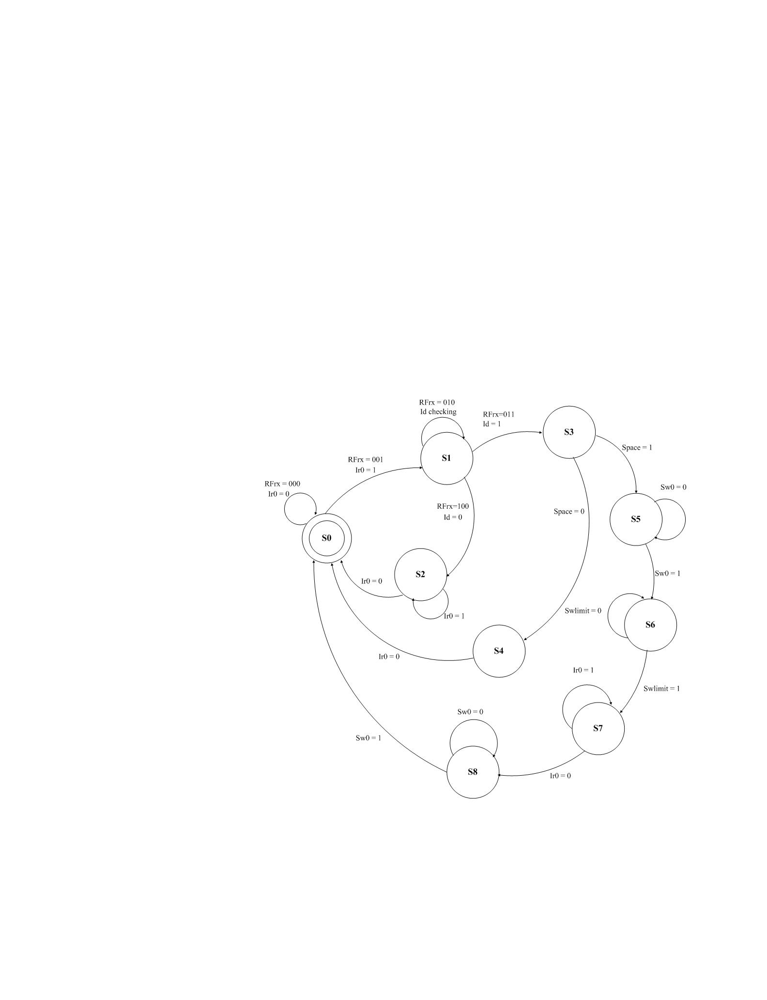
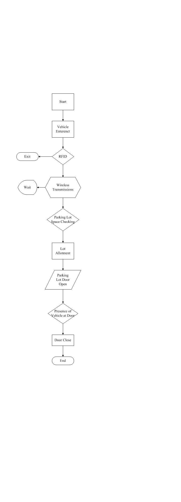

# Optimized Design of a Parking Management System Using FPGA

## 📘 Published Research (ICoST 2015)

**Umar, W., et al.**
*Optimized Design of a Parking Management System Using FPGA.*
International Conference on Science and Technology (ICoST), 2015.

🔗 IEEE Xplore Link: [ https://ieeexplore.ieee.org/document/7029343/ ]

This work presents a high-speed, FPGA-based smart parking management system implemented using Verilog HDL on a Xilinx Spartan-3E board.

## 🎥 Hardware Demonstration

▶️ Watch the working hardware implementation here:  
[(https://www.automotionparking.com/)]

(System implemented and verified on Xilinx Spartan-3E FPGA board)*

## 🚀 Key Technical Contributions

### 🔹 High-Speed Processing
- Designed using a **50 MHz clock frequency**
- Significantly faster than traditional microcontroller-based systems
- Deterministic hardware-level processing

### 🔹 Wireless Security Integration
- RFID authentication module
- RF transmitter/receiver communication
- Secure vehicle identification before gate control

### 🔹 Parallel FPGA Architecture
- Modular Verilog design
- All modules execute within a single clock cycle
- Efficient use of FPGA parallelism

## 🧠 Finite State Machine (FSM) Design

The system is built using structured FSM modeling:

- Vehicle Arrival Detection
- Slot Availability Check
- RFID Authentication
- Gate Control Logic
- Exit Monitoring

This structured design approach ensures reliability and deterministic control flow.

---

## 🏗 Hardware & Simulation Gallery

### 🔹 RTL View

### 🔹 FSM State Transition Diagram

### 🔹 FSM Algorithum

---

## 🔬 Technical Stack

- Verilog HDL
- Xilinx ISE
- ISim Simulator
- Xilinx Spartan-3E FPGA
- RFID Modules
- RF Transmitter/Receiver Modules

---

## 🌱 Future Work

The ASMD (Algorithmic State Machine Diagram) methodology used in this design can be extended toward:

- Modeling biological neural pathways
- Neuropathic-inspired hardware architectures
- Event-driven parallel processing systems
- FPGA-based neuromorphic accelerators

---

## 👩‍💻 Author

**Wajeeha Umar**  
Master of Engineering – Microsystem Design  
Specializing in FPGA-based digital logic and FSM modeling.  
Interested in the intersection of hardware parallelism and neuropathic system architectures.

## 📊 Project Presentation

Download the full PowerPoint presentation here:

[Download PPT](FPGA_Presentation.pptx)

📊 View Presentation Online:  
[View PPT]
https://docs.google.com/presentation/d/1JvyinaMvLk1TPMsPpXOavcKaj_DhbBsD/edit?slide=id.p13#slide=id.p13

📊 View full paper Online:  
chrome-extension://efaidnbmnnnibpcajpcglclefindmkaj/https://drive.usercontent.google.com/download?id=1H5Bs1-ifYgVuP_oLtR4ND7HwXJcmUP8v&authuser=0&acrobatPromotionSource=gdrive_chrome-list
